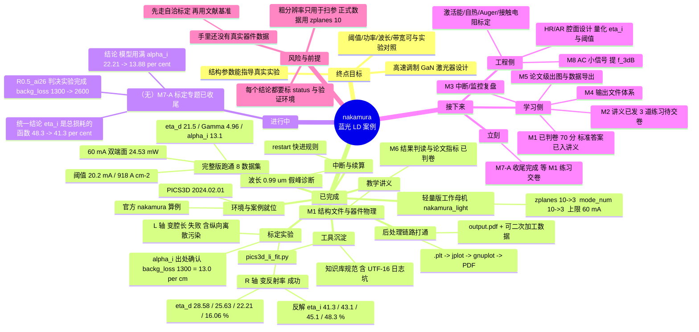

# nakamura 案例仿真全景图

> 一句话：**用官方 nakamura 蓝光激光器案例，把 PICS3D 从"建结构"到"出论文指标"整条链路跑通并学会判读，再把方法迁移到高速调制 GaN 激光器的设计上。**

## 一、思维导图（Mermaid，Obsidian 直接可渲染）

## 二、时间线：都跑了哪些仿真

| # | 日期 | 算例 | 关键设置 | 结果/结论 |
|---|---|---|---|---|
| 1 | 09-09 ~ 09-11 | `nakamura`（完整版） | zplanes=10, mode_num=10, 到 300 mA | 8 个数据集，拿到阈值/功率/Γ/损耗/波长/电压全套指标 |
| 2 | 09-14 ~ 09-16 | `nakamura` 续算 + 光耦合 | restart / auto_finish | 解决"波长跳到 0.99 µm 假峰"，写出续算流程笔记 |
| 3 | 09-16 | `nakamura_light`（轻量版） | zplanes=3, mode_num=3, ≤60 mA | 4 个数据集，单轮 ~4 h，成为后续扫参的"工作母机" |
| 4 | 09-16 → 09-18 | `nakamura_LI`（**v6**，第一次尝试） | `auto_until` 0.6 → 0.4，扫到 80 mA | 只跑到数据集 #6（49.71 mA）就停了，未完成 |
| **4b** | **09-24 → 09-27** | **`nakamura_LI` v6 收尾轮 ✅** | `restart data_set=2`（唯一已证实安全的起点）；scan2 = RTG 初始化，scan3 = 耦合扫到 80 mA | **8 个新数据集 DS3–DS10（19.71 → 80.00 mA）全部落地，09-27 20:04:43 正常收尾**；`Warning: big change in lambda` **0 次**；10 次 `Solver failed` 全部被"减小步长"自动救回；10 个 `.std` 全部 37,466,650 B |
| **4c** | 09-27 | **v4 vs v6 的 L-I 对比** | 同一套提取脚本（膝点+5~+35 mA） | ✅ 证明 v4 的"21.73 mA 以下平台"是**耦合起点的伪影**（v6 起点提前 2 mA，平台就正好短 2 mA；26 mA 以上两曲线重合）；**外推阈值两轮一致 ≈21.4 mA**，但阈值对拟合窗口敏感（20.4~22.7 mA）→ 详见 [[06-案例/nakamura v4-vs-v6 L-I拐点对比]] |
| 5 | 09-18 | **L 系列**（变腔长 300/550/800/1200） | 只改 `uniform_length` | ❌ J_th 非单调 → 诊断出纵向离散污染，L 轴不可信 |
| 6 | 09-18 | **R 系列**（变反射率 0.2/0.35/0.5/0.7） | 只改 `left/right_f_refl` | ✅ 四个算例全部正常结束，L-I 曲线漂亮 |
| 7 | 09-19 | **R 系列后处理与标定** | `pics3d s2.plt` + gnuplot + `pics3d_li_fit.py` | ✅ η_d = 28.58/25.63/22.21/16.06 %，拟合 r²=0.99993 |
| 8 | 09-19 → 09-20 | **`R0.5_ai26`** 判决实验 ✅ | `backg_loss` 1300 → 2600 | Int._loss 13.14→24.94 /cm；I_th 22.73→26.25 mA（+15.5 %，预测 +15.4 %）；**η_d 22.21 % → 13.88 %** → 功率公式用满 α_i |

## 三、R 系列（第 7 项）到底得出了什么

## 二·补、各算例目录的"体检结果"（2026-09-23 核查）

| 算例目录 | exe 版本戳 | 数据集 | 状态 |
|---|---|---|---|
| `nakamura`（完整版） | 2024.2.1 | **8 个**，每个 37,466,650 B | ✅ 完全成功 |
| `nakamura_LI` | 2024.2.1 | 8 个，每个 37,466,650 B | ✅ 完全成功 |
| `nakamura_light`（轻量版首次运行） | **2018.1.1** | 4 个，但 0002~0004 只有 **8,001 B** | ❌ **`.std` 被截断**（旧版 exe 写出），只有数据集 #1 可用；其 `jplot024.tmp` 全是 0 |
| `nakamura_light_L300/550/800/1200` | 2024.2.1 | 4 个，每个 11,285,362 B | ✅（L 轴本身不可信，但**文件是完整的**）|
| `nakamura_light_R0.2/0.35/0.5/0.7` | 2024.2.1 | 4 个，每个 11,285,362 B | ✅ |
| `nakamura_light_R0.5_ai26` | 2024.2.1 | 4 个，每个 11,285,362 B | ✅ |
| `nakamura_light_T1~T4` | — | **0 个** | 从未真正运行（只有输入文件）|

结论：**完整版 nakamura 与 2024 版跑的所有派生算例都完全成功**；
"轻量版基准" `nakamura_light` 这一份是 2018 版 exe 的产物，`.std` 2~4 被截断 → 要用基准数据请用 **`nakamura_light_R0.5`**（同几何/同偏置，DS3=21.49 mA、DS4 的 `Int._loss`=13.14 /cm 与它逐项一致，但文件完整）。
详见 [[07-故障排查/std文件被截断（旧版本exe）]]。

## 二·补二、完整版的版本谱系：`nakamura`(v4) vs `nakamura_LI`(v6)

两个目录的 `s2.sol` 头部注释写明了各自的身份：

| | `nakamura` | `nakamura_LI` |
|---|---|---|
| `s2.sol` 自述 | **RESUME FILE v4**（2026-09-15） | **RESUME FILE v6**（2026-09-16）【可选：为了看清 L-I 阈值拐点】 |
| 用的 exe | 2024.2.1 | 2024.2.1 |
| 偏置设置 | `auto_until=0.6`（首段）/ `0.62`；扫到 60 mA，`print_step=10e-3` | `auto_until=**0.4**`；扫到 **80 mA**，`print_step=10e-3` |
| 设计意图 | 把结构跑通、修掉"波长跳到 0.99 µm" | **修掉 v4 的 L-I 假平台**：v4 的光耦合段从 21.73 mA 才开始，之前的 photon density 被强制为 0 → 拐点看不出来；v6 让耦合扫描从阈值（≈20 mA）以下起步 |
| 数据集完成度 | **DS1 → DS8 齐全**（DS8 = 60 mA，2026-09-16 04:03 收尾） | **只到 DS6（49.71 mA）就停了**（2026-09-18 09:44），**缺 DS7 及以后** |
| 数据集来源 | 全部本目录产出（跨 4 段续算拼成，09-09 → 09-16） | **混的**：DS1/DS2（09-09）、DS8（09-16）是从 v4 继承的旧文件；只有 DS3–DS6 是 v6 新算的；DS7 被改名成 `s2.std_00078_STALE_prev` 后未补 |
| 能否直接当一套数据用 | ✅ 可以（也是全库所有分析所用的那一份） | ❌ 不能（缺数据集 + 新旧参数混用） |

### v6 的数据集时间线（可见它跑到哪里停的）

| 数据集 | 电流 | 写入时间 | 来源 |
|---|---|---|---|
| DS1 | 0 mA（平衡态） | 09-09 21:18 | v4 继承 |
| DS2 | 1 mA | 09-09 22:16 | v4 继承 |
| **DS3** | **19.71 mA**（`auto_until=0.4` 的停止点） | 09-16 19:23 | **v6 新算** |
| **DS4** | 29.71 mA | 09-17 03:18 | v6 |
| **DS5** | 39.71 mA | 09-17 11:45 | v6 |
| **DS6** | 49.71 mA | 09-18 09:44 | v6（**最后一份**） |
| DS7 | （应为 59.71 mA） | — | ❌ 缺 |
| DS8 | 60 mA | 09-16 04:03 | v4 继承（**与 DS7 的位置冲突**，所以不能当连续序列） |

> 判断"最终收尾版"的正确口径：
> **按版本号/设计意图 → `nakamura_LI`(v6) 更新**（它就是为收尾 L-I 而写的）；
> **按"跑完且自洽" → `nakamura`(v4) 才是当前唯一完整的收尾版**。

### 想把 v6 收尾：走过的弯路 + 最终可行的路（重要教训）

2026-09-23 试过两条"省时间"的路，**都失败**（两次失败的完整指纹见 [[04-操作流程/PICS3D续算与光耦合初始化]] 的两个"反例实测"）：

| 尝试 | 想法 | 结果 |
|---|---|---|
| `restart data_set=6` | 跳过 DS3–DS6 的重算，直接续到 80 mA | ❌ 耦合段之前**没有** RTG 初始化扫描 → λ 跳到 0.999 µm 并以 0.1 %/步爬行 |
| `data_set=6` + 在耦合段前**补插**一段 `auto_finish=rtgain` | 让初始化段在 DS6 就地补做 | ❌ DS6 已在阈值以上，RTG 高于目标带上限 → 4 次 `Exceeding auto_finish limit` → 步长崩到 3.9e-8 A → 退出 |

**最终可行且已被证实的路**：`restart data_set=2` —— 恢复点落在**亚阈值**数据集，跳过后第一段正好是 RTG 初始化扫描。
2026-09-24 09:20 启动 → **09-27 20:04 正常收尾**，产出 DS3–DS10 共 8 个数据集。

> **铁律**：续算点必须落在亚阈值数据集上（RTG 初始化段的终点或更早）。RTG 初始化段**无法**在已激射的偏置上就地完成。

| R | α_m (/cm) | η_d 实测 | 按 α_i=13.0 反算 η_i |
|---|---|---|---|
| 0.20 | 29.26 | 28.58 % | 41.3 % |
| 0.35 | 19.09 | 25.63 % | 43.1 % |
| 0.50 | 12.60 | 22.21 % | 45.1 % |
| 0.70 | 6.48 | 16.06 % | 48.3 % |

四条硬结论（第 4 条由 ai26 判决实验给出，见时间线第 8 项）：

1. **α_i 是输入值 13.0 /cm**（`init_wave backg_loss=1300`，且被 `.sol.msg` 的 `Int._loss`=13.10 /cm 互证）；
2. **η_i 随镜面损耗减小而升高**（41.3 % → 48.3 %）—— 阈值载流子密度低 → Auger/泄漏少，物理上完全合理；所以"变反射率法假设 η_i 为常数"在本结构不成立，直接套公式会得到偏低的假 α_i（8.4 /cm）；
3. **R 轴可用、L 轴不可信**（固定 zplanes=3 时改腔长会改变纵向平面间距）。
4. **η_i 是"总损耗 α_i+α_m"的函数，不是 α_m 的函数**：ai26（α_i=26、α_m=12.60、总损耗 38.60 /cm）给出 42.5 %，
   恰好落在 R0.35（32.09 /cm，43.1 %）与 R0.2（42.26 /cm，41.3 %）之间。
   量化斜率：**总损耗每 +1 /cm，η_i 掉约 0.3 个百分点**（48.3 % @19.5 /cm → 41.3 % @42.3 /cm）。

## 四、接下来要做什么

### 立刻（v6 已完成，回到学习侧）

✅ **v6 收尾轮 09-27 20:04 完成**，并已做完 v4-vs-v6 的 L-I 对比 → [[06-案例/nakamura v4-vs-v6 L-I拐点对比]]。

- **M7-A 结论**（已收尾）：α_i = 13.0 /cm 是输入值，功率公式用满它；η_i 是**总损耗**的单值函数（19.5 /cm → 48.3 %，42.3 /cm → 41.3 %），不是 α_m 的函数；
- **v4/v6 结论**：v4 的"21.73 mA 以下平台"确认是**耦合起点伪影**；**外推阈值两轮一致 ≈21.4 mA**（窗口敏感 20.4~22.7 mA）；η_d ≈ 22~23 %。

下一步：**M2 的 3 道练习**（`.sol` 作业）——这是唯一还欠着的教学环节。

### 学习侧（M1~M5 补齐）

| 模块 | 待做 |
|---|---|
| M1 | ✅ 已判卷（70 分），标准答案见讲义第 8 节 |
| M2 | ⏳ 讲义已发，交 3 道练习：三段偏置判停条件 / 改电流与 `print_step` / **从零写一个能跑通的 `.sol`** |
| M3 | 中断/续算与监控复盘（已有两篇笔记做底） |
| M4 | 输出文件体系：任何结果都能说出在哪个文件里 |
| M5 | 论文级出图 + `data_file` 导出可二次加工数据 |

### 工程侧（通向 M7 / M8）

1. **腔面设计量化**：用 η_i(R) 曲线算 HR/AR 镀膜能把 η_i 提到多少、阈值降多少（注意：已验证 HR/AR **不降阈值**，镜面损耗 31.2 → 27.7 /cm）；
2. **面向真实实验的标定**：p 掺杂激活能、自热、Auger、接触电阻、电流阻挡（需要你提供文献结构）；
3. **M8 高速调制**：DC 偏置到位后写 `ac.plt`（`ac_voltage` + `plot_ac_curr`），提 `f_3dB`、谐振峰、K 因子。

## 五、总体计划目标（三句话）

1. **近期**：把 nakamura 这一个案例吃透 —— 结构、求解、监控、输出、判读、标定，每一步都能自己动手；
2. **中期**：换成真实/文献结构，让阈值、电压、波长落到实验值的 ±20 % 以内（M7 验收）；
3. **终点**：给出"**结构 → 阈值 / 功率 / 带宽**"的定量趋势表，并对高速调制 GaN 激光器芯片提出可执行的工艺建议（M8 验收）。

## 相关笔记

- [[00-入口/PICS3D激光器仿真培训计划]] ← M1~M8 教学主线
- [[00-入口/教学/M1-结构文件与器件物理]]
- [[00-入口/教学/M6-结果判读与论文指标]]
- [[00-入口/教学/M7A-变腔长自洽标定]]
- [[06-案例/nakamura v4-vs-v6 L-I拐点对比]] ← **v4/v6 的 L-I 拐点对比（"假平台"伪影的判定 + 阈值窗口敏感性）**
- [[04-操作流程/激光器阈值判定与L-I分析]]
- [[04-操作流程/PICS3D中断续算]]
- [[04-操作流程/PICS3D续算与光耦合初始化]]
- [[06-案例/nakamura结构物理分析与优化]]
- [[06-案例/nakamura-sol逐行注释]]
- [[07-故障排查/常见错误索引]]

## 来源

本库 nakamura 系列算例实测（2026-09-09 ~ 09-19，PICS3D 2024.02.01，`C:\Users\ciomp\Documents\2024Ver_pics3d_examples\pics3d_examples\blue_LD\`）。
数值口径：η_d 由 `jplot024.tmp` 的 L-I 线性区最小二乘得到，拟合窗口「出光膝点 +5 ~ +35 mA」；
α_m = (1/2L)·ln(1/(R₁R₂))；η_i = η_d·(1 + α_i/α_m)。
