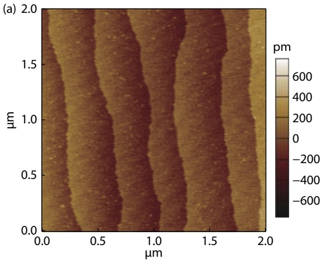
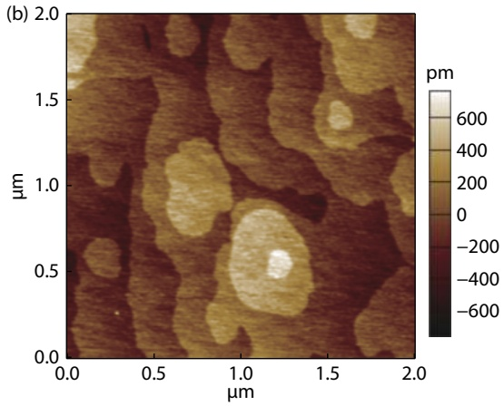
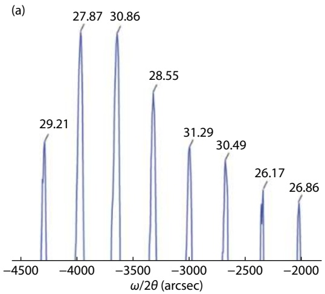
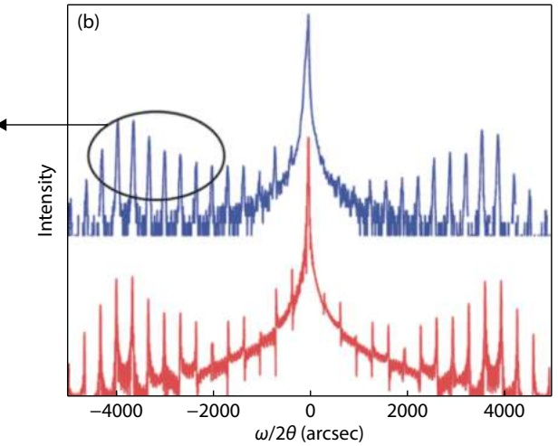
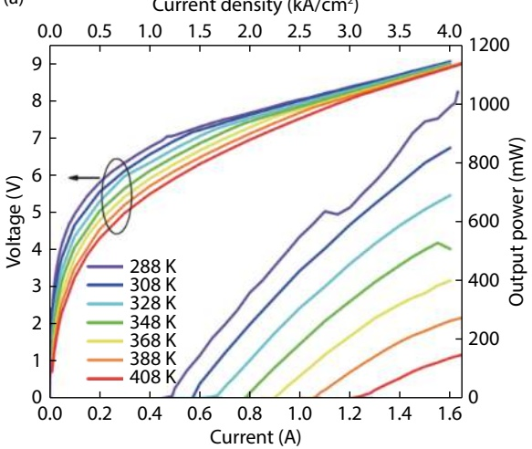
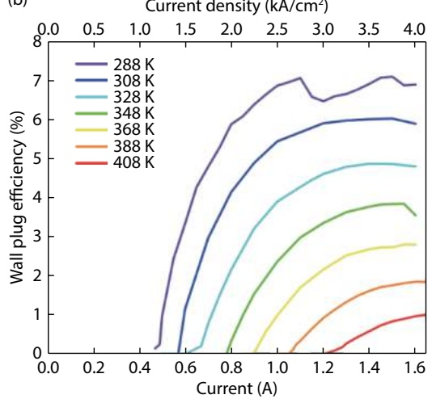
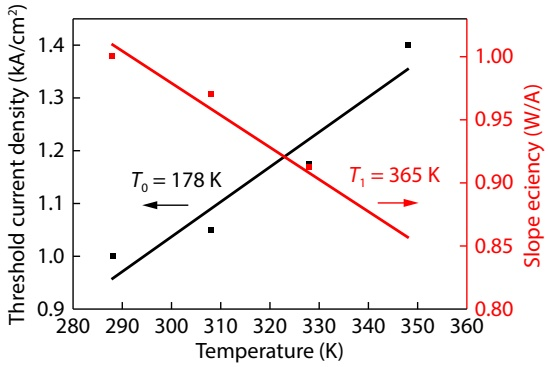
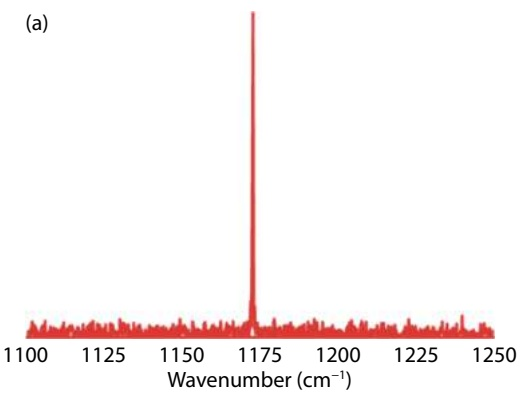
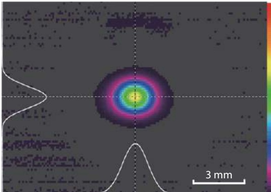

## High power λ \~ 8.5 μm quantum cascade laser grown by MOCVD operating continuous-wave up to 408 K

Teng Fei, Shenqiang Zhai, Jinchuan Zhang, Ning Zhuo, Junqi Liu, Lijun Wang, Shuman Liu, Zhiwei Jia, Kun Li, Yongqiang Sun, Kai Guo, Fengqi Liu, and Zhanguo Wang

Citation: T Fei, S Q Zhai, J C Zhang, N Zhuo, J Q Liu, L J Wang, S M Liu, Z W Jia, K Li, Y Q Sun, K Guo, F Q Liu, and Z G Wang, High power \~ 8.5 m quantum cascade laser grown by MOCVD operating continuous-wave up to 408 K[J]. [J. Semicond.](http://www.jos.ac.cn), 2021, 42(11).

View online: [https://doi.org/10.1088/1674-4926/42/11/112301](https://doi.org/10.1088/1674-4926/42/11/112301)

## Articles you may be interested in

[Broad area quantum cascade lasers operating in pulsed mode above 100 ℃ at](http://www.jos.ac.cn/article/doi/10.1088/1674-4926/38/7/074005) λ [\~4.7](http://www.jos.ac.cn/article/doi/10.1088/1674-4926/38/7/074005) μ [m](http://www.jos.ac.cn/article/doi/10.1088/1674-4926/38/7/074005)

Journal of Semiconductors. 2017, 38(7), 074005 [https://doi.org/10.1088/1674-4926/38/7/074005](https://doi.org/10.1088/1674-4926/38/7/074005)

[Room temperature continuous wave operation of quantum cascade laser at](http://www.jos.ac.cn/article/shaid/779cd886b20b706e938f2ed74ad51250fba003fa966e50da8876f5b2a89a1f70) λ [\~ 9.4](http://www.jos.ac.cn/article/shaid/779cd886b20b706e938f2ed74ad51250fba003fa966e50da8876f5b2a89a1f70) μ [m](http://www.jos.ac.cn/article/shaid/779cd886b20b706e938f2ed74ad51250fba003fa966e50da8876f5b2a89a1f70)

Journal of Semiconductors. 2018, 39(3), 034001 [https://doi.org/10.1088/1674-4926/39/3/034001](https://doi.org/10.1088/1674-4926/39/3/034001)

[Room-temperature continuous-wave operation of GaN-based blue-violet laser diodes with a lifetime longer than 1000 h](http://www.jos.ac.cn/article/shaid/ebb24ec4312d481702e75d8fd3fcff366850b36d06a2b0d5bd07cb6137f7fcde)

Journal of Semiconductors. 2019, 40(2), 022801 [https://doi.org/10.1088/1674-4926/40/2/022801](https://doi.org/10.1088/1674-4926/40/2/022801)

[Fabrication of room temperature continuous-wave operation GaN-based ultraviolet laser diodes](http://www.jos.ac.cn/article/doi/10.1088/1674-4926/38/5/051001)

Journal of Semiconductors. 2017, 38(5), 051001 [https://doi.org/10.1088/1674-4926/38/5/051001](https://doi.org/10.1088/1674-4926/38/5/051001)

[Coupled-ridge waveguide quantum cascade laser array lasing at λ \~ 5 m](http://www.jos.ac.cn/article/shaid/a22d5dda1eb187d489cdbfba40bbfe5485d0a0466ca6c2803b3ae40954a9df44)

Journal of Semiconductors. 2021, 42(9), 092901 [https://doi.org/10.1088/1674-4926/42/9/092901](https://doi.org/10.1088/1674-4926/42/9/092901)

[Metal-organic framework composites for energy conversion and storage](http://www.jos.ac.cn/article/shaid/3cecdf8a2c4763f6a99ed3519fcc6e5a2e40c6519580b6bfa7f0d35da8caa3cc)

Journal of Semiconductors. 2020, 41(9), 091707 [https://doi.org/10.1088/1674-4926/41/9/091707](https://doi.org/10.1088/1674-4926/41/9/091707)

关注微信公众号，获得更多资讯信息

# High power λ \~ 8.5 μm quantum cascade laser grown by MOCVD operating continuous-wave up to 408 K

**Teng Fei**<strong>1</strong>**, 2, 3, Shenqiang Zhai**<strong>1</strong>**, 2, †, Jinchuan Zhang**<strong>1</strong>**, 2, Ning Zhuo**<strong>1</strong>**, 2, Junqi Liu**<strong>1</strong>**, 2, 3, Lijun Wang**<strong>1</strong>**, 2, 3, Shuman Liu**<strong>1</strong>**, 2, Zhiwei Jia**<strong>1</strong>**, 2, Kun Li**<strong>1</strong>**, 2, 3, Yongqiang Sun**<strong>1</strong>**, 2, 3, Kai Guo**<strong>1</strong>**, 2, Fengqi Liu**<strong>1</strong>**, 2, 3, †, and Zhanguo Wang**<strong>1</strong>**, 2, 3**

1Key Laboratory of Semiconductor Materials Science, Institute of Semiconductors, Chinese Academy of Sciences, Beijing 100083, China 2Beijing Key Laboratory of Low Dimensional Semiconductor Materials and Devices, Beijing 100083, China

3Center of Materials Science and Optoelectronics Engineering, University of Chinese Academy of Sciences, Beijing 100049, China

**Abstract:** Robust quantum cascade laser (QCL) enduring high temperature continuous-wave (CW) operation is of critical importance for some applications. We report on the realization of lattice-matched InGaAs/InAlAs/InP QCL materials grown by metalorganic chemical vapor deposition (MOCVD). High interface quality structures designed for light emission at 8.5 μm are achieved by optimizing and precise controlling of growth conditions. A CW output power of 1.04 W at 288 K was obtained from a 4 mm-long and 10 μm-wide coated laser. Corresponding maximum wall-plug efficiency and threshold current density were 7.1% and 1.18 kA/cm2, respectively. The device can operate in CW mode up to 408 K with an output power of 160 mW.

**Key words:** quantum cascade laser; metal-organic chemical vapor deposition; continuous-wave; interface roughness

**Citation:** T Fei, S Q Zhai, J C Zhang, N Zhuo, J Q Liu, L J Wang, S M Liu, Z W Jia, K Li, Y Q Sun, K Guo, F Q Liu, and Z G Wang, High power λ \~ 8.5 μm quantum cascade laser grown by MOCVD operating continuous-wave up to 408 K[J]. J. Semicond., 2021, 42(11), 112301. [http://doi.org/10.1088/1674-4926/42/11/112301](http://dx.doi.org/10.1088/1674-4926/42/11/112301)

## 1.  Introduction

Quantum cascade lasers[1](QCLs) are compact and powerful light sources covering mid-infrared (MIR) to terahertz regimes. Based on the cascaded intersubband transitions, QCLs have been applied in various scientific and industrial applications, such as optical frequency comb[2] and gas sensing[3]. High power continuous-wave (CW) operation QCLs are strongly needed to achieve long-distance sensing and communication. Since the first realization of QCL in 1994, novel designs such as bound-to-continuum[4](BTC) and double-phonon resonance[5](DPR) have been raised to realize high-performance QCLs. Molecular beam epitaxy (MBE) is widely used to grow the active core of QCLs, because of two main features: sharp interfaces and precise control of layer thickness. However, for the reason of high vacuum operating processes, MBE technique bears low QCL production capacity and high QCL cost. Another competitive counterpart technique, metalorganic chemical vapor deposition (MOCVD), has been used for growing high quality QCL wafers with high yield. Several groups have reported high-performance CW operated QCLs grown by MOCVD. Watt-level room temperature CW output power of InGaAs/InAlAs material system using multi-composition QCL emitting at λ \~ 8 μm[6], lattice-matched QCL emitting at λ \~ 9 μm[7], and strain-balanced QCL emitting at λ \~ 10 μm[8] have been reported. By taking into account the effect of interface grading, which is a fundamental phenomenon in MOCVD-grown materials, Wang et al. redesigned the band structures and realized high-performance QCLs emitting from 7.5 to 9.3 μm[7].

Despite the aforementioned achievements, MOCVD-grown QCLs possess three drawbacks: (1) in the long-wave infrared (LWIR, 8–12 μm) region, the maximum wallplug efficiency (WPE) of room temperature CW operating QCL is no more than 7%, which is much less than that of MBE-grown QCLs[9, 10]. (2) Although the room temperature CW output power of MOCVD-grown QCLs in LWIR region can reach 1 W, the power drops rapidly when temperature increases. (3) Compared with MBE-grown QCLs, the MOCVD-grown QCLs show relatively larger threshold current density. All three presented points mainly root in interface roughness (IFR). In fact, MOCVD is based on complicated gas sources reactions in a low-pressure condition, which results in much longer gas residence time compared with MBE. The hetero-interfaces of In-GaAs/InAlAs are unavoidable graded[11], which leads to enhanced IFR. As a result, the optical loss and threshold current density of MOCVD-grown devices are generally higher[6, 12]. This effect is more severe in LWIR due to the diagonal nature of the laser transition, thereby hindering the improvement of power efficiency and working temperature of MOCVD-grown QCLs[13]. Therefore, the interface quality of QCL active region becomes crucial.

In this letter, we report the demonstration of high-performance QCLs grown by MOCVD. By optimizing and precise controlling of growth conditions, high interface quality latticematched InGaAs/InAlAs/InP QCL structure is obtained. Wattlevel room temperature CW operated devices emitting at λ \~ 8.5 μm give WPE higher than all these previously reported results. Furthermore, the devices are robust, proved by the output power as high as 160 mW in CW mode at 408 K.

<small>Correspondence to: S Q Zhai, z[sqlzsmbj@semi.ac.cn;](mailto:zsqlzsmbj@semi.ac.cn) F Q Liu, [fqliu@semi.ac.cn](mailto:fqliu@semi.ac.cn) Received 7 SEPTEMBER 2021; Revised 16 SEPTEMBER 2021. ©2021 Chinese Institute of Electronics</small>

Fig. 1. AFM images $( 2 \times 2   \mu \mathsf { m } ^ { 2 } )$ of lattice-matched of (a) InGaAs and (b) InAlAs in contact mode.

## 2.  Material growth and characterization

The structures were fully grown using a low-pressure (100 mbar) MOCVD with a close-coupled showerhead reactor. Group III precursors are trimethylindium (TMIn), trimethylgallium (TMGa), and trimethylaluminum (TMAl). Group V precursors are arsine and phosphine. The n-type dopant is SiH4 $(0.02\% \mathrm{inH_2})$ . Typical growth parameters are in the ranges: substrate temperatures $600-700^{\circ}C;$ growth rates for QCL active components $( \mathsf { I n } _ { 0 . 5 3 } \mathsf { G a } _ { 0 . 4 7 } \mathsf { A s }$ and $\mathsf{In}_{0.52}\mathsf{Al}_{0.48}\mathsf{As}) \quad 0.1-0.5$ nm/s; growth rates for waveguide and cladding layers (n-type doped InP) 0.3–0.8 nm/s; V/III ratios 15–200; growth interrupts at the interfaces of InGaAs-to-InAlAs and InAlAs-to-In-GaAs 0–5 s. The QCL active region consists of \~500–1000 In-GaAs wells and InAlAs barrier layers, with thicknesses ranging between 0.5 to 6 nm, and the precisions of thickness and alloy composition should be achieved as best as we can. To put this in perspective, we first realized lattice matched 1 μm-thick $\mathsf { I n } _ { 0 . 5 3 } \mathsf { G a } _ { 0 . 4 7 } \mathsf { A s }$ and $\mathsf { I n } _ { 0 . 5 2 } \mathsf { A I } _ { 0 . 4 8 } \mathsf { A s }$ by varying the growth parameters. The optimal ranges were determined by the background doping and electron mobility obtained from Hall measurement and the surface morphology obtained from atomic force microscopy (AFM). Fig. 1 shows the surface images of lattice-matched $\mathsf { I n } _ { 0 . 5 3 } \mathsf { G a } _ { 0 . 4 7 } \mathsf { A s }$ (left) and $\mathsf { I n } _ { 0 . 5 2 } \mathsf { A I } _ { 0 . 4 8 } \mathsf { A s }$ (right) layers measured by AFM. Step-flow mode can be observed, indicating good surface morphology. The morphology of InAlAs shows moderate degradation, which is reasonable due to the low migration rate of Al atoms. Pre-cise control over the layer thicknesses and compositions was ensured using process calibration with the combination of optical in-situ and ex-situ techniques, such as scanning electron microscopy (SEM) and high resolution X-ray diffraction (XRD). Then the QCL structure can be grown under specify growth conditions.

Considering the relatively large allowance for structure fluctuations, single phonon resonance-continuum depopulation QCL structure was adopted[14]. For the reason of relative high growth temperature, the crystal quality of MOCVD-grown QCL is no longer an issue. The main detrimental factor is the interface roughness. Iterative optimized experiments of growth conditions including growth temperature, growth rates, V/III ratios, and growth interrupts between $\mathsf { I n } _ { 0 . 5 3 } \mathsf { G a } _ { 0 . 4 7 } \mathsf { A s }$ and $\mathsf { I n } _ { 0 . 5 2 } \mathsf { A I } _ { 0 . 4 8 } \mathsf { A s }$ interfaces have been conducted to achieve high interfacial quality.

The QCL structure similar to Ref. [11] was fully grown on n-doped InP substrate $( 5 , 2   \times   1 0 ^ { 1 8 } \mathrm { { \sf c m } ^ { - 3 } } )$ . The layer thicknesses in nanometers, starting from the first injection barrier, are as follows: **4.0**/1.3/**1.0**/5.2/**0.9**/5.1/**1.0**/4.7/**1.6**/3.6/**2.2**/ $\mathbf { 2 . 9 / 1 . 8 / 2 . 7 / 1 . 9 / 2 . 6 / 2 . 0 / 2 . 4 / 2 . 5 / 2 . 5 / 3 . 1 / 2 . 3 } ,$ where InAlAs barriers are in bold, InGaAs wells in roman, and underlined numbers correspond to the doped layers $( \mathsf { S i } ,   2 \times 1 0 ^ { 1 7 } \; \mathsf { c m } ^ { - 3 } )$ . The epitaxial layer sequence starting from the InP substrate is as follows: 0.5 μm InP buffer layer $( \mathsf { S i } ,   1 \times 1 0 ^ { 1 7 }   \mathsf { c m } ^ { - 3 } ) ,   3   \mu \mathsf { m }$ lowdoped InP cladding layer $( \mathsf { S i } ,   4 \times 1 0 ^ { 1 6 } \; \mathsf { c m } ^ { - 3 } )$ , 300 nm InGaAs confinement layer $( { \mathsf { S i } } , ~ 5 ~ \times ~ 1 0 ^ { 1 6 } ~ { \mathsf { c m } } ^ { - 3 } ) ,$ 35 periods InGaAs-InAlAs active structure, 300 nm InGaAs confinement layer (Si, $5 \times 1 0 ^ { 1 6 } \; \mathrm { c m } ^ { - 3 } ) , \; 3 . 3$ μm low-doped InP cladding layer (Si, 4 × $1 0 ^ { 1 6 }   \mathsf { c m } ^ { - 3 } ) ,$ , 0.4 μm graded-doped InP layer $( \mathsf { S i } ,   1 \times 1 0 ^ { 1 7 }   \mathsf { c m } ^ { - 3 } -$ $1 \times 1 0 ^ { 1 8 } ~ \mathrm { c m ^ { - 3 } ) }$ , and 0.3 μm InP contact layer $( \mathsf { S i } , \; 5   \times   1 0 ^ { 1 8 }$ $\mathsf { C m } ^ { - 3 } )$ Here we choose the thicknesses of InGaAs confinement layers to be 300 nm to reduce thermal accumulation. The simulation[15] showed that reducing the thickness of the In-GaAs confinement layer could remove heat efficiently with (Γ)the small penalty to confinement factor .

Fig. 2(a) compares the measured and simulated high-resolution XRD results. Experimental result is almost fully in line with the simulated one. Fig. 2(b) shows the enlarged view of satellite diffraction peaks with full width at half maximum (FWHM) labelled, which are given by fitting the peaks with a Gaussian distribution. Multiple high-order satellite peaks can be clearly observed with extremely sharp and narrow FWHM of about 30 arcsec. In order to characterize interfaces smoothness, it is crucial to have a reliable means of determining the IFR in the grown structures. A rapid and efficient technique is the high-resolution $\mathsf { X R D } ^ { [ 1 6 , 1 7 ] }$ . The observation of multiple satellite diffraction peaks is a criterion for evaluating a highquality hetero-interface which indicates excellent in-plane homogeneity in terms of layer thickness and chemical composition[18]. According to the kinematic theory of X-ray diffraction, the FWHM of the nth satellite peak is strongly related to $\mathbb { F R } ^ { [ 1 9 ] }$ . The observed FWHM values of MOCVD-grown QCLs are comparable with those of MBE-grown QCLs of similar structure[3], indicating the comparable interfacial qualities. The above narrow satellite peaks imply small IFR, which guarantees the high performance of QCLs. Although other groups have reported watt-level MOCVD grown QCLs, no credible narrow satellite peaks are presented. MIT Lincoln Laboratory have made efforts for MOCVD-grown QCL many years and achieved a series of prominent results. But the reported FWHM of satellite peaks in lattice-matched InGaAs/InAlAs superlattice is larger than 40 arcsec[11].

Fig. 2. (a) High-resolution XRD of experimental (blue, upper curve) and simulated (red, lower curve) results of lattice-matched QCL structures. (b) Partially enlarged view of satellite diffraction peaks. The full-width at half-maximum (FWHM) of satellite diffraction peaks are labelled in arcsec.

(a)

(b)

Fig. 3. (a) Power–current–voltage relations of 10 μm × 4 mm-long, and HR coated laser at different temperatures in CW condition. (b) WPE versus current injection characteristics at different temperatures

## 3.  Device performance

The fabrication process of QCLs is as follows. The wafer was processed into a buried hetero-structure (BH) configuration with a ridge width of 10 $\mu \mathsf { m } .$ . Firstly, the wafer was patterned into stripes along with [110] direction by using a 300 nm-thick $\mathsf { S i O } _ { 2 }$ mask and wet-etched through the active region into a double-channel geometry. The etchant is 1 : 1 : 10 $\mathsf{HBr:HNO_{3}:H_{2}O}$ which is non-selective and isotropic. The etching depth was controlled step by step down to the bottom of the active region with an etching profile similar to a trapezoid geometry. After etching and rinsing, Fe-doped semi-insulating InP was selective-area regrown by MOCVD to planarize the channels. In order to guarantee the quality of InP in channels, the etching profile should be well controlled. Considering wet etching is soft, different profile can be easily achieved. Wet etching was chosen to form specific channels profile. Then $\mathsf { S i O } _ { 2 }$ mask was removed, and a new 300 nm-thick $\mathsf { S i O } _ { 2 }$ layer was deposited by plasma-enhanced chemical vapor deposition as an electrical isolation layer. The current injection windows were opened on the top of the ridge by lithography and HF etching. Besides, top contact was made, including a Ti/Au layer by e-beam evaporation and a 5 μm-thick Au layer by electroplating. After the wafer was thinned down to 120 μm and polished, an AuGeNi/Au layer was evaporated as the bottom contact. Finally, the processed wafer was cleaved into 4 mm bars, and a high-reflectivity coating consisting of $\mathrm{Al}_{2}\mathrm{O}_{3}/\mathrm{Ti}/\mathrm{Au}/\mathrm{Ti}/\mathrm{Al}_{2}\mathrm{O}_{3}$ (200/10/100/ 10/120 nm) was applied on the back facet with the front facet left uncoated. For packaging, the chips were soldered epi-down on diamond submounts to improve heat removal efficiency. Then the submounts with chips were mounted on the copper heat sinks with indium solder followed by wire bonding.

Fig. 3(a) shows CW power and applied voltage versus current (PIV) curve at different temperatures. The CW optical power was measured by fixing a laser on the water-cooling platform with a chip facet close to a calibrated thermopile detector. The temperature was monitored by a thermistor and controlled by a thermoelectric cooler (TEC). A total amount of

Fig. 4. Threshold current density and slope efficiency at different temperatures in pulse conditions at 1 μs, 1% duty cycle.

1.04 W CW output power was obtained at 288 K, with a threshold current density of 1.18 $\mathsf { k A } / \mathsf { c m } ^ { 2 } .$ Fig. 3(b) shows the calculated WPE versus injection current at different temperatures. The maximum WPE is 7.1% at 288 K, which is higher than all previously published results obtained from MOCVD-grown LWIR QCLs. In addition, the threshold current density presented here is among the lowest (1.6 kA/cm2in Ref. [20], and 2.5 kA/cm2in Ref. [21]) when compared with other highpower (watt-level) LWIR QCLs.

Besides relatively high efficiency and low threshold current density, a remarkable feature is that QCLs work up to 408 K in CW mode with the output power of 160 mW and the WPE of 1%. This distinctive feature gives the direct evidence that the QCLs are robust. CW operation in high temperature is difficult to achieve which limited by the natural cascade characteristic of QCLs. A dedicated effort has been put from the perspective of the active region, waveguide optimization, device process, and thermal management[22, 23]. Although Wittman et al. have reported that QCL grown by MBE can operate at a record high temperature of 423 K using AlN submounts, its power was limited to about $0 . 5 ~ \mathsf { m W } ^ { [ 2 3 ] }$ . Here, in our case, the maximum temperature is only limited by our heat sink solder. Considering the melting point of indium solder is 430 K, we did not further increase the temperature to prevent the indium contact from melting. By using a goldtin alloy with a melting point of 550 K as heat sink solder, the device has the potential to operate at much higher temperatures.

Fig. 4 shows temperature-dependent threshold current density $J _ { \mathrm { t h } }$ and slope efficiency η in pulse mode. According to the empirical formulas:

$$
J _ {\mathrm{th}} = J _ {0} \exp \left(T / T _ {0}\right),
$$

$$
\eta_ {\text {slope}} = \eta_ {0} \exp \left(- T / T _ {1}\right),
$$

where T is the heat sink temperature, $T _ { 0 }$ and $T _ { 1 }$ are the characteristic temperature coefficient of the pulsed threshold-current density and slope efficiency. The fitting parameters are $T _ { 0 } = 1 7 8 \mathrm {  ~ K ~ }$ and $T _ { 1 } = 3 6 5 \mathsf { K } .$ Besides the relatively low threshold current density, the $T _ { 0 }$ of the device is comparable with the best value from the MBE-grown QCLs with AlN submounts[23].

Combining with the above characterization of material properties, it is credible to ascribe the high performances of our QCLs to the reduced IFR. The IFR can be approximated by parameterizing the random roughness profile of the interface, i.e., the average root-mean-square height ∆ and the characteristic lateral dimension Λ of the roughness. The IFR scattering rate of a QCL is given $\mathbf { b } \mathbf { y } ^ { [ 2 4 ] } ;$

$$
\hbar \tau_ {\mathrm{IFR}} ^ {- 1} = \frac {\pi m ^ {*}}{\hbar^ {2}} \Delta^ {2} \Lambda^ {2} \delta U ^ {2} \sum_ {i} \left[ \phi_ {2} (z _ {i}) \phi_ {1} (z _ {i}) \right] ^ {2} \mathrm{e} ^ {- \frac {\Lambda^ {2} q _ {2 1} ^ {2}}{4}},
$$

where $m ^ { \star }$ is the conduction band electron effective mass, h̷ is the normalized Planck's constant, $\delta U ^ { 2 }$ is the conduction band offset, $\phi _ { 2 } ( z _ { i } )$ and $\phi _ { 1 } ( z _ { i } )$ are the wavefunction amplitudes at the th interface, $q _ { 2 \tau }$ is the absolute value of the two-dimensional scattering vector. As can be seen from this expression, the IFR scattering rate is approximately proportional to the square of the IFR. The IFR plays an important role in the intersubband scattering process by reducing the lifetime of the upper state. It has been proved both theoretically and experimentally that IFR scattering is the dominant intersubband scattering mechanism for the long wavelength (>8 μm) QCLs[24]. On the other hand, hetero-interfaces induced interface optical phonons couple strongly with electrons, give significant contribution to the lifetime of the electrons. Theoretical calculation has been deduced that the interface phonons in the active region can be classified into bulk modes and surface modes[25]. The combined scatterings from LO-phonons, interface optical phonons, and IFR cause the total carrier leakage to reach values as much as an order of magnitude higher than conventional inelastic scattering-only leakage[26]. What is more, the IFR scattering induced thermally activated current leakage will be enlarged with the increase of operating temperature[27]. Therefore, larger upper states lifetime and thus higher gain coefficient can be expected due to the reduced IFR, which has been confirmed by the record-narrow XRD satellite peaks. The reduced IFR improves effectively the temperature starting point for current leakage, resulting in the high operating temperature of QCLs.

Fig. 5(a) shows the device lasing spectrum at room temperature. Emission spectrum centering at $1 1 7 5 ~ \mathsf { c m } ^ { - 1 }$ (8.5 μm) was obtained by Fourier transformed infrared spectrometer (FTIR) with a resolution of $0 . 2 5 ~ \mathsf { c m } ^ { - 1 }$ in rapid scan mode. The transverse mode is another characteristic affecting the actual application of QCLs. Fig. 5(b) shows the beam image in pulse mode operation. The fundamental transverse mode could be clearly observed by placing a pyroelectric camera 20 cm away from the collimated chip, demonstrating this $\mathsf { T } M _ { 0 0 }$ beam is suitable for practical applications.

## 4.  Conclusion

In conclusion, high-performance CW operation QCL grown by MOCVD is demonstrated. High-quality interface quantum cascade structures can be realized by carefully controlling and optimizing growth conditions. The 4 mm-long, HR-coated QCL device exhibits 1.04 W CW output at 288 K at $\lambda \sim 8 . 5 ~ \mu \mathsf { m }$ . The threshold current density and wall-plug efficiency are 1.18 $\mathsf { k A } / \mathsf { c m } ^ { 2 }$ and 7.1%, respectively. The device shows the capability to operate at 408 K, and the CW optical power is still 160 mW, showing a robust temperature characteristic. In addition, the fundamental transverse mode can be clearly observed. Future work should be conducted on longer devices with anti-reflective coating on the front side to reach higher CW power and WPE.

(b)

Fig. 5. (a) Emission spectrum at current slightly above threshold. (b) Beam picture in pulse mode at room temperature.

## Acknowledgements

The authors would thank Ping Liang and Ying Hu for their help with device fabrication. This work was supported by the National Key Research and Development Program of China (Grant No. 2020YFB0408401), in part by the National Natural Science Foundation of China (Grant Nos. 61991430, 61774146, 61790583, 61734006, 61835011, 61674144, 61774150, 61805168), in part by Beijing Municipal Science & Technology Commission (Grant No. Z201100004020006), and in part by the Key Projects of the Chinese Academy of Sciences (Grant Nos. 2018147, YJKYYQ20190002, QYZDJ-SSW-JSC027, XDB43000000, ZDKYYQ20200006).

## References

Faist J, Capasso F, Sivco D, et al. Quantum cascade laser. [Science,](http://dx.doi.org/10.1126/science.264.5158.553)[1] [1994, 264(5158), 553](http://dx.doi.org/10.1126/science.264.5158.553)

Hugi A, Villares G, Blaser S, et al. Mid-infrared frequency comb[2] based on a quantum cascade laser. [Nature, 2012, 492(7428), 229](http://dx.doi.org/10.1038/nature11620)

Zhang J, Wang L, Zhang W, et al. Holographic fabricated continu-[3] ous wave operation of distributed feedback quantum cascade lasers at λ ≈ 8.5 μm. [J Semicond, 2011, 32(4), 044008](http://dx.doi.org/10.1088/1674-4926/32/4/044008)

Faist J, Beck M, Allen T, et al. Quantum-cascade lasers based on a[4] bound-to-continuum transition. [Appl Phys Lett, 2001, 78(2), 147](http://dx.doi.org/10.1063/1.1339843)

Beck M, Hofstetter D, Aellen T, et al. Continuous wave operation[5] of a mid-infrared semiconductor laser at room temperature. [Science, 2002, 295(5553), 301](http://dx.doi.org/10.1126/science.1066408)

Botez D, Kirch J D, Boyle C, et al. High-efficiency, high-power mid-[6] infrared quantum cascade lasers. [Opt Mater Express, 2018, 8(5), 1378](http://dx.doi.org/10.1364/OME.8.001378)

Wang C A, Schwarz B, Siriani D F, et al. MOVPE growth of LWIR Al-[7] InAs/GaInAs/InP quantum cascade lasers: Impact of growth and material quality on laser performance. [IEEE J Sel Top Quantum Electron, 2017, 23(6), 1](http://dx.doi.org/10.1109/JSTQE.2017.2677899)

Feng X, Caneau C, Leblanc H P, et al. Watt-level room tempe-[8] rature continuous-wave operation of quantum cascade lasers with λ >10 μm. [IEEE J Sel Top Quantum Electron, 2013, 19](http://dx.doi.org/10.1109/JSTQE.2013.2240658)(4), [1200407](http://dx.doi.org/10.1109/JSTQE.2013.2240658)

Schwarz B, Wang C A, Missaggia L, et al. Watt-level continuous-[9] wave emission from a bifunctional quantum cascade laser/detector. [ACS Photonics, 2017, 4(5), 1225](http://dx.doi.org/10.1021/acsphotonics.7b00133)

Zhou W, Lu Q Y, Wu D H, et al. High-power, continuous-wave,[10] phase-locked quantum cascade laser arrays emitting at 8 microm. [Opt Express, 2019, 27(11), 15776](http://dx.doi.org/10.1364/OE.27.015776)

Wang C A, Schwarz B, Siriani D F, et al. Sensitivity of heterointer-[11] faces on emission wavelength of quantum cascade lasers. [J Cryst Growth, 2017, 464, 215](http://dx.doi.org/10.1016/j.jcrysgro.2016.11.029)

[Lyakh A, Maulini R, Tse](http://dx.doi.org/10.1016/j.jcrysgro.2016.11.029)koun A, et al. 3 W continuous-wave room[12] temperature single-facet emission from quantum cascade lasers based on nonresonant extraction design approach. [Appl Phy](http://dx.doi.org/10.1063/1.3238263)s [Lett, 2009, 95(14), 141113](http://dx.doi.org/10.1063/1.3238263)

[Khurgin J B, Dikmelik Y, Li](http://dx.doi.org/10.1063/1.3238263)u P Q, et al. Role of interface roughness[13] in the transport and lasing characteristics of quantum-cascade lasers. [Appl Phys Lett, 2009, 94(9), 091101](http://dx.doi.org/10.1063/1.3093819)

Fujita [K, Furuta S, Sugiyama A, et al. High-](http://dx.doi.org/10.1063/1.3093819)performance λ \~8.6 μm[14] quantum cascade lasers with single phonon-continuum depopulation structures. [IEEE J Quantum Electron, 2010, 46(5), 683](http://dx.doi.org/10.1109/JQE.2010.2048015)

Figueiredo P, Sut[tinger M, Go R, et al. Progress in high-pow](http://dx.doi.org/10.1109/JQE.2010.2048015)er con-[15] tinuous-wave quantum cascade lasers. [Appl Opt, 2017, 56(31), H15](http://dx.doi.org/10.1364/AO.56.000H15)

[Yu T](http://dx.doi.org/10.1364/AO.56.000H15), Liu S, Zhang J, et al. InAs-based interband cascade lasers at[16] 4.0 μm operating at room temperature. [J Semicond, 2018, 39(11), 114003](http://dx.doi.org/10.1088/1674-4926/39/11/114003)

[Fewste](http://dx.doi.org/10.1088/1674-4926/39/11/114003)r P F. Interface roughness and period variations in MQW[17] structures determined by X-ray diffraction. [J Appl Cryst, 198](http://dx.doi.org/10.1107/S0021889888006569)8, [21(5), 524](http://dx.doi.org/10.1107/S0021889888006569)

[Fewster P](http://dx.doi.org/10.1107/S0021889888006569) F. X-ray diffraction from low-dimensional structures.[18] [Semicond Sci Technol, 1993, 8(11), 1915](http://dx.doi.org/10.1088/0268-1242/8/11/001)

[Savage D, Kleiner J, Schimke N, et al.](http://dx.doi.org/10.1088/0268-1242/8/11/001) Determination of rough-[19] ness correlations in multilayer films for x-ray mirrors. [J Appl Phys, 1991, 69(3), 1411](http://dx.doi.org/10.1063/1.347281)

[Botez D, Chang C](http://dx.doi.org/10.1063/1.347281) C, Mawst L J. Temperature sensitivity of the elec-[20] tro-optical characteristics for mid-infrared (λ = 3 –16 μm)-emitting quantum cascade lasers. [J Phys D, 2015, 49(4), 043001](http://dx.doi.org/10.1088/0022-3727/49/4/043001)

Lyakh A, Maulini R, Tsekoun [A, et al. Multiwatt long wave](http://dx.doi.org/10.1088/0022-3727/49/4/043001)length[21] quantum cascade lasers based on high strain composition with 70% injection efficiency. [Opt Express, 2012, 20(22), 24272](http://dx.doi.org/10.1364/OE.20.024272)

Yang P, Zhang J, Gu Z, e[t al. Coupled-ridge waveguide q](http://dx.doi.org/10.1364/OE.20.024272)uantum[22] cascade laser array lasing at λ \~ 5 μm. [J Semicond, 2021, 42(9), 092901](http://dx.doi.org/10.1088/1674-4926/42/9/092901)

Wittmann A, Bonetti Y, Fischer M, et al. Distributed-feedback[23] quantum-cascade lasers at 9 μm operating in continuous wave up to 423 K. [IEEE Photonics Technol Lett, 2009, 21(12), 814](http://dx.doi.org/10.1109/LPT.2009.2019117)

Chiu Y, Dikmelik Y, Liu P Q, et al. Importance of interface rough-[24] ness induced intersubband scattering in mid-infrared quantum cascade lasers. [Appl Phys Lett, 2012, 101(17), 171117](http://dx.doi.org/10.1063/1.4764516)

Xu G, Li A. Interface phonons in the active region of a quantum cas-[25] cade laser. [Phys Rev B, 2005, 71(23), 235304](http://dx.doi.org/10.1103/PhysRevB.71.235304)

Boyle C, Oresick K M, Kirch J D, et al. Carrier leakage via interface-[26] roughness scattering bridges gap between theoretical and experimental internal efficiencies of quantum cascade lasers. [Appl Phys Lett, 2020, 117(5), 051101](http://dx.doi.org/10.1063/5.0007812)

Semtsiv M P, Flores Y, Chashnikova M, et al. Low-threshold inter-[27] subband laser based on interface-scattering-rate engineering. [Appl Phys Lett, 2012, 100(16), 163502](http://dx.doi.org/10.1063/1.3701824)

Teng Fei earned his bachelor’s degree from the Faculty of Electronic Information and Electrical Engineering, Dalian University of Technology in 2018. He is now a PhD Student in Key Laboratory of Semiconductor Materials Science at the Institute of Semiconductors, Chinese Academy of Sciences. He is mainly interested in the research of material epitaxial growth of mid-infrared quantum cascade lasers, devices and applications.

Shenqiang Zhai is an Associate Professor in Key Laboratory of Semiconductor Materials Science at the Institute of Semiconductors, Chinese Academy of Sciences. He earned his PhD degree in Institute of Semiconductors, Chinese Academy of Sciences in 2014. He is mainly engaged in the research of material epitaxial growth of Mid-infrared quantum cascade lasers, devices and applications, and has published more than 30 papers.

Fengqi Liu is a Professor in Key Laboratory of Semiconductor Materials Science at the Institute of Semiconductors, Chinese Academy of Sciences. He earned his PhD degree in Department of physics Nanjing University in 1996. Recently, he has demonstrated the quantum dot cascade laser by two-step strain-compensation active region and material grown technique. He is a Winner of National Outstanding Youth Fund in China.