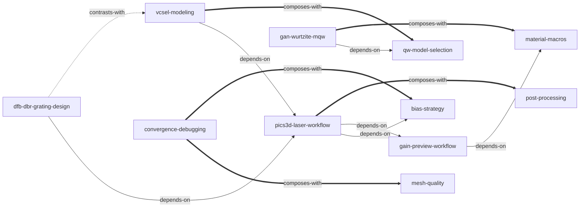

# Crosslight Device Simulation Software General Manual — Skill Index

> 本书由 cangjie-skill 蒸馏，共产出 **11** 个 skills。
> 处理时间: 2026-08-14

## 关于这本书

- **作者**: Crosslight Software Inc.
- **出版年**: 2024 版（更新 2024-11-06，© 1995-2024）
- **一句话主旨**: 把半导体光电器件（尤其激光器）的物理方程变成可执行、可收敛的 TCAD 仿真工作流。
- **整书理解**: 见 [BOOK_OVERVIEW.md](./BOOK_OVERVIEW.md)
- **精华长文** (不读全书看这篇): [DIGEST.md](./DIGEST.md)
- **术语词典**: [GLOSSARY.md](./GLOSSARY.md)

---

## Skill 列表 (按主题分组)

### 激光器仿真流程（PICS3D 核心）

- [`pics3d-laser-workflow`](./pics3d-laser-workflow/SKILL.md) — PICS3D 激光仿真标准工作流：三步偏置 + RTG 初始化
- [`dfb-dbr-grating-design`](./dfb-dbr-grating-design/SKILL.md) — DFB/DBR 纵向模式与光栅设计（κ/相移/啁啾）
- [`vcsel-modeling`](./vcsel-modeling/SKILL.md) — VCSEL 建模：section/驻波/圆柱坐标
- [`gain-preview-workflow`](./gain-preview-workflow/SKILL.md) — 增益与光谱预览（.gain 工作流）
- [`bias-strategy`](./bias-strategy/SKILL.md) — 电压/电流偏置策略与多电极控制

### 物理模型

- [`gan-wurtzite-mqw`](./gan-wurtzite-mqw/SKILL.md) — GaN 纤锌矿 MQW 建模（极化/自洽/基晶格）
- [`qw-model-selection`](./qw-model-selection/SKILL.md) — 量子阱模型分级与选择
- [`material-macros`](./material-macros/SKILL.md) — 材料宏体系、单位与自定义覆盖

### 数值与质量

- [`convergence-debugging`](./convergence-debugging/SKILL.md) — 收敛故障诊断与对策工具箱
- [`mesh-quality`](./mesh-quality/SKILL.md) — 网格生成与质量检查

### 结果分析

- [`post-processing`](./post-processing/SKILL.md) — 后处理：数据组织、变量与绘图

---

## 引用图



图例: `-->` depends-on · `-.->` contrasts-with · `===>` composes-with

---

## 推荐学习顺序

（从依赖图叶子节点向上）

1. **material-macros** — 材料/单位/宏基础，无前置
2. **bias-strategy** — 偏置决策基础，无前置
3. **qw-model-selection** — QW 模型分级基础，无前置
4. **gain-preview-workflow** — 依赖 material-macros（.gain include .mater）
5. **mesh-quality** — 网格基础
6. **pics3d-laser-workflow** — 依赖偏置+增益预览，激光仿真总纲
7. **dfb-dbr-grating-design** — 依赖工作流
8. **vcsel-modeling** — 依赖工作流 + QW 模型
9. **gan-wurtzite-mqw** — 依赖 QW 模型，叠加 GaN 物理
10. **convergence-debugging** — 配合 mesh/bias 使用
11. **post-processing** — 流程终点出图

---

## 安装使用

本目录是构建产物，宿主不会从这里加载 skill。要让 agent 真正调用，把 skill 目录复制到宿主的 skills 目录（Codex 用户级: `~/.codex/skills/`）：

```bash
cp -r pics3d-laser-workflow ~/.codex/skills/
cp -r convergence-debugging ~/.codex/skills/
# ... 其余 skill 同理
```

---

## 接入 darwin-skill

所有 skill 均带有 `test-prompts.json`（darwin-skill 兼容格式），可直接接入自动进化：

```
darwin evolve books/crosslight-manual/
```

---

## 审计轨迹

- 候选单元池: [candidates/](./candidates/)
- 被淘汰的候选（含原因）: [rejected/](./rejected/)
- BOOK_OVERVIEW: [BOOK_OVERVIEW.md](./BOOK_OVERVIEW.md)
- 压力测试结果: 各 skill 目录内 test-results.md
