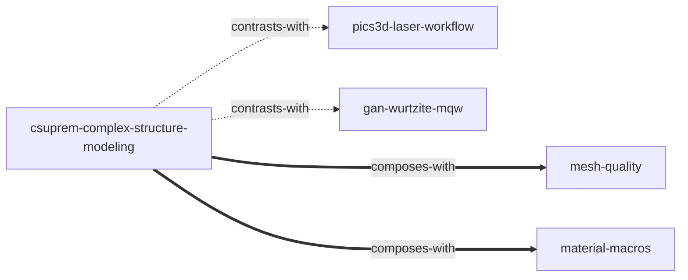

# CSuprem 复杂结构设计建模 — Skill Index

> 本资料集由 cangjie-skill 蒸馏，共产出 **1** 个 skill。
> 处理时间: 2026-08-17

## 关于本资料集

- **作者**: Crosslight Software Inc.（CSuprem 源自 Stanford Suprem4）
- **出版年**: 手册 2004-2014（v3.0）；教程 2008
- **一句话主旨**: CSuprem 用"网格线 + 区域/边界 + 工艺步骤"把真实器件结构逐步建出来，可扩展为 3D 并导出给 APSYS。
- **整书理解**: [BOOK_OVERVIEW.md](./BOOK_OVERVIEW.md)
- **精华长文** (不读全书看这篇): [DIGEST.md](./DIGEST.md)
- **术语词典**: [GLOSSARY.md](./GLOSSARY.md)

---

## Skill 列表

### 结构建模与工艺仿真

- [`csuprem-complex-structure-modeling`](./csuprem-complex-structure-modeling/SKILL.md) — CSuprem 复杂结构设计建模：网格线-区域-边界体系、工艺步骤演化、2D→3D 转换、GDSII 导入、APSYS 导出对接。

---

## 引用图



图例: `===>` composes-with（组合） / `-.->` contrasts-with（对比）

---

## 推荐学习顺序

1. **BOOK_OVERVIEW.md** — 先建立全局骨架（30 分钟）；
2. **csuprem-complex-structure-modeling** — 主 skill，按 E 段 6 步执行；
3. 需要网格细节时并行参考 `mesh-quality`；需要材料编号/宏时参考 `material-macros`；确认"该不该用工艺仿真"时对照 `pics3d-laser-workflow`。

---

## 安装使用

本目录是构建产物，宿主不会从这里加载 skill。安装到 Codex 用户级 skills 目录：

```bash
cp -r csuprem-complex-structure-modeling ~/.codex/skills/
```

---

## 接入 darwin-skill

skill 带有 `test-prompts.json`（darwin-skill 兼容格式），可直接接入自动进化：

```
darwin evolve books/csuprem-complex-structure/
```

---

## 审计轨迹

- 候选单元池: [candidates/](./candidates/)
- 被淘汰的候选 (含原因): [rejected/](./rejected/)
- 三重验证结果: [verified.md](./verified.md)
- BOOK_OVERVIEW: [BOOK_OVERVIEW.md](./BOOK_OVERVIEW.md)
